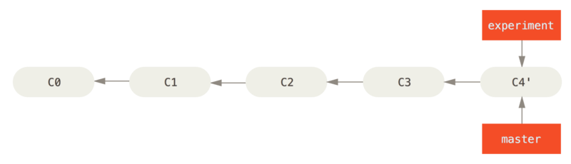

#git rebse
>变基操作，在当前分支里提交快照转移到目标分支里重新提交一遍

##基本的变基操作
    git rebase <branch_name>
    
*   ###参数
    *   branch_name 目标分支名

在 Git 中整合来自不同分支的修改主要有两种方法：merge 以及 rebase。这里主要讨论rebase操作，并且区别与merge之间的差别。它的原理是回到两个分支最近的共同祖先为起点，根据当前分支的历次提交快照，生成一系列文件补丁，然后往目标分支（基底分支）最后一次提交快照为新出发点，逐个应用提交快照，让当前分支直接继承目标分支。

#### merge 与 rebase 区别和 rebase 变基操作例子


这里有一个开发分支，并且在C2处开始分裂出两个不同的分支，并各自提交更新。

##### merge命令


merge命令它会把两个分支的最新快照（C3 和 C4）以及二者最近的共同祖先（C2）进行三方合并，合并的结果是生成一个新的快照（并提交）。

##### rebase 变基操作例子


其实，还有一种方法：你可以提取在 C4 中引入的补丁和修改，然后在 C3 的基础上应用一次。 在 Git 中，这种操作就叫做 变基 rebse。你可以使用 rebase 命令将提交到某一分支上的所有修改都移至另一分支上，就好像“重新播放”一样。

````bash
$ git checkout experiment
$ git rebase master
First, rewinding head to replay your work on top of it...
Applying: added staged command
````
 


将 C4 中的修改变基到 C3 上，现在回到 master 分支，进行一次快进合并。

````bash
$ git checkout master
$ git merge experiment
````