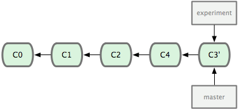

#git rebse
>变基操作，在当前分支里提交快照转移到目标分支里重新提交一遍

##基本的变基操作
    git rebase <branch_name>
    
*   ###参数
    *   branch_name 目标分支名

它的原理是回到两个分支最近的共同祖先为起点，根据当前分支的历次提交快照，生成一系列文件补丁，然后往目标分支（基底分支）最后一次提交快照为新出发点，逐个应用提交快照，让当前分支直接继承目标分支。

当前experiment分支就是当前分支，向master调用一次变基操作。

然后回到 master 分支，进行一次快进合并：

现在的 C3' 对应的快照，其实和普通的三方合并。虽然最后整合得到的结果没有任何区别，但变基能产生一个更为整洁的提交历史。如果视察一个变基过的分支的历史记录，看起来会更清楚：仿佛所有修改都是在一根线上先后进行的，尽管实际上它们原本是同时并行发生的。