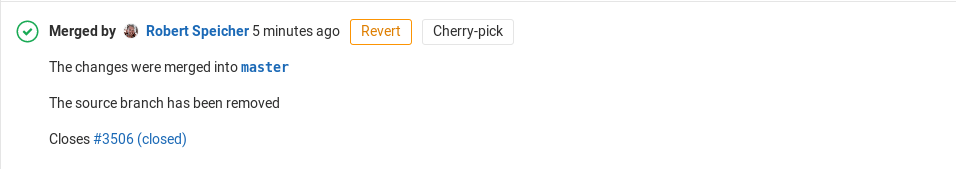

#如何撤销 Merge Request？
>GitLab 组合了 Git的强大功能可以撤销任何的commit提交。当你需要撤销你之前merge request过的代码，以下就介绍在GitLab上是如何操作

##撤销一个Merge Request
1.  当一个 Merge Request 已经合并了，会出现一个名为 Revert 按钮，让你撤回当前的Merge Request。

1.  按下按钮后，一个弹出会出现，GitLab会让你选择两种不同的方法，方法1：直接撤销该分支（不建议），方法2：新建一个新的merge request[^1]用来提交撤销操作（建议）。
1.  如果上一步选择了新的merge request来执行撤销操作，只需要合并该merge request就完成操作。
### 注意
1.  一旦撤销成功，Revert 按钮就不可再点击
1.  如果目标分支是保护分支（protected branch）直接在目标分支做撤销操作通常是不起作用[^2]

##如何重新提交
1.  由于被撤销合并的分支已经在目标分支合并过，所以继续在被撤销的分支上再有任何的修改，再次提交mr也不会被git侦测到有修改[^3]
1.  解决方法需要把本地的目标分支更新到最新版本，然后拉一个新的分支用于重新提交代码的新分支(例如命名为：re-merge-branch),然后使用命令 git revert (<tree-ish>) (tree-ish提交索引哈希）让该分支回滚到合并目标分支的状态，然后在这分支上进行修改。
1.  修改完成后再按照[基于 Merge Request 的开发流程](gitlab-merge-request.md)里所介绍的步骤重新提交一次mr即可[^4]。

[^1]: Git此时会自动生成一个新的revert分支
[^2]: 此处未经过任何验证，建议使用方法2
[^3]: 原因是被合并分支一旦被撤销，无论该分支的提交记录是最新的，也无法被git判断为新的提交
[^4]: 这个操作未能在GitHub里面成功实现，暂时未有解决方法