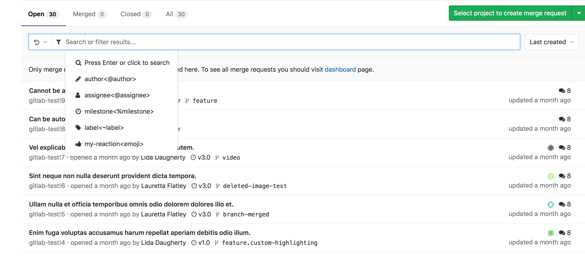

#基于 Merge Request 的开发流程
> 在 GitLab 上创建的项目，所有人都不应该直接往 master 分支推送代码。而是应该在个人的本地分支（一般fetch master分支）进行开发。并最终通过创建 Merge Request（类似 GitHub pull request）将代码合并到 master 分支。

##使用Merge Request几个好处
1. 方便代码审查，及时发现问题
1. 重要分支设置为受保护（master/staging），杜绝了有些问题代码被提交了，但项目经理不知道的情况；
1. 每个任务都有一个对应的分支，互相隔离，所有的功能提交有据可查；

##开发流程一般步骤

1.  在master拉出新的分支 
1.  在新的分支上编写代码
1.  推送修改代码 
1.  创建MergeRequest 
1.  管理员审核代码与Merge代码

##创建merge Request 具体操作流程
1.  点击左侧导航栏 Merge requests进入页面，点击New merge request
1.  选择需要合并的分支和目标分支

1.  填写合并标题（Title），描述（Description），审核人（Assignee）

1.  当确认无误后，点击 Submit merge request 按钮

### TIPS 
GitLab支持WIP标记（ Work In Progress），只要在合并标题添加“\[WIP]” 或 “WIP:”开头，Git会自动提醒管理员，当前分支未完成，不能进行合并操作。另外，在提交审查之前，请检查是否有删除WIP标记。

##管理员审核代码与Merge代码具体操作流程
1.  点击左侧导航栏 Merge requests进入页面
1.  选择其中一个 Merge requests

1.  页面下方会有三个tab页面分别为：查看讨论留言（Discussion），查看提交记录（Commits）、查看更改内容（changes）

1.  查看讨论留言（Discussion）可以快速查看代码审核内提出问题留言
1.  查看提交记录（Commits）可以查看代码提交记录，用于审查分支是否有异常提交

1.  查看更改内容（changes）用于审查代码

1.  当发现代码中有问题时候，管理员可以在相应的位置，点击气泡图案，进行Discussion

1.  而相关的开发同事应该就可以在Discussion Tab中找到问题，与管理员进行讨论或者修复bug，然后再次上传一次commit到该远程分支即可，不用再次提交Merge requests。然后返回到该Discussion点击resolve按钮，表示修复问题。

1.  当管理员认为可以进行合并时候，点击 merge 按钮即可完成一次Merge requests。

### 注意
1.  如果当前分支与目标分支存在冲突（conflict）是不能够与当前分支进行合并。所以在准备提交之前，如果当前分支出现冲突，请根据情况把当前分支与目标分支先(rebase/merge)，在本地解决冲突。因为只有代码作者本人才熟悉代码逻辑结构，解决冲突的责任应由本人操作。
1.  如果当前工程含有CI/CD部署，一旦分支合并就会自动执行部署任务。

